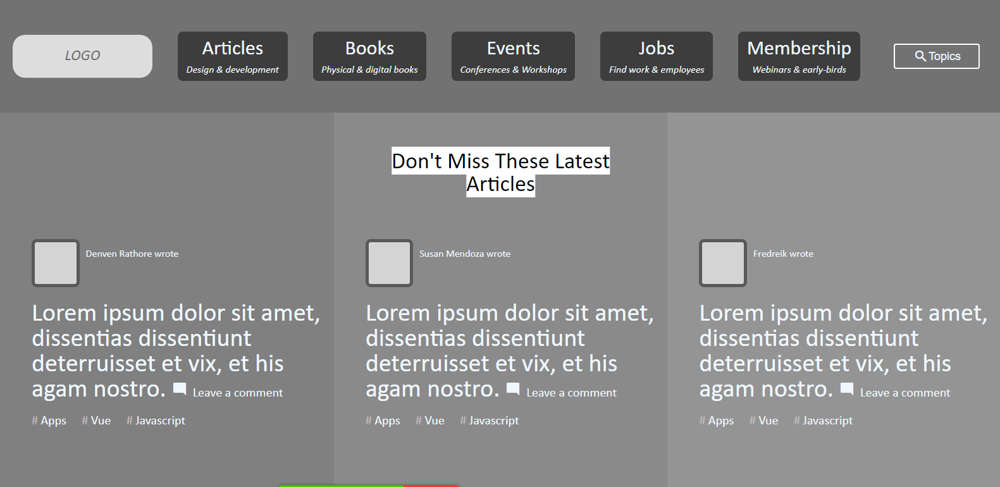

# Design TearDown

> This project consists of building a heatmap of the [smashing magazine website](https://www.smashingmagazine.com/).
> 

## Built With

- HTML,
- CSS,
- Flexbox,
- CSS Grid

## Live Demo

[Live Demo Link](https://emmanuelaaron.github.io/smashing-magazine/)

## Getting Started
Clone this repo on your local machine

### Prerequisites
To make this repository working in your local machine you need only a browser.

## Authors

👤 **Emmanuel Isabirye**

- Github: [@EmmanuelAaron](https://github.com/Emmanuelaaron)
- Twitter: [@EmmanuelAaron](https://twitter.com/EmmanuelIsabir1)
- Linkedin: [Emmanuel Isabirye](https://www.linkedin.com/in/fullstackwebdev-emma/)

👤 **Guilherme Recordon**

- Github: [@guirecordon](https://github.com/guirecordon)
- Twitter: [@RecordonG](https://twitter.com/RecordonG)
- Linkedin: [Guilherme Recordon](https://linkedin.com/gui-recordon-marketingmba/)

## 🤝 Contributing

Contributions, issues and feature requests are welcome!

Feel free to check the [issues page](https://github.com/Emmanuelaaron/smashing-magazine/issues).

## Show your support

Give a ⭐️ if you like this project!

## Acknowledgments

- Great Thanks to Microverse and the Odin project.

## 📝 License

This project is [MIT](lic.url) licensed.
